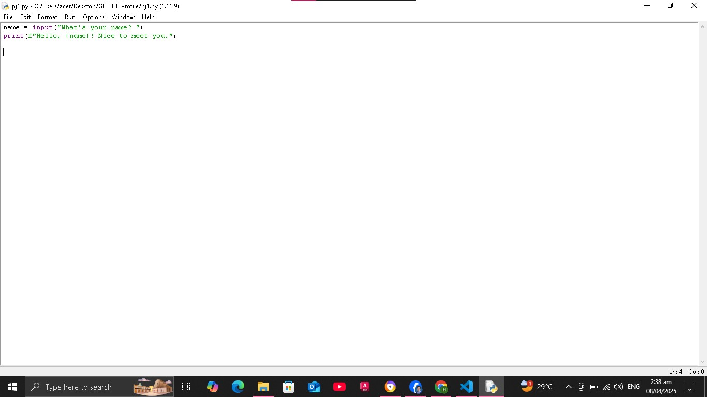
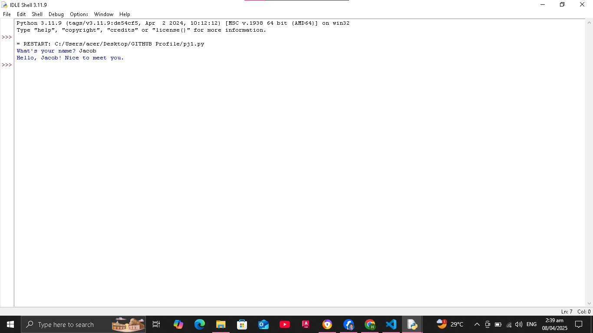
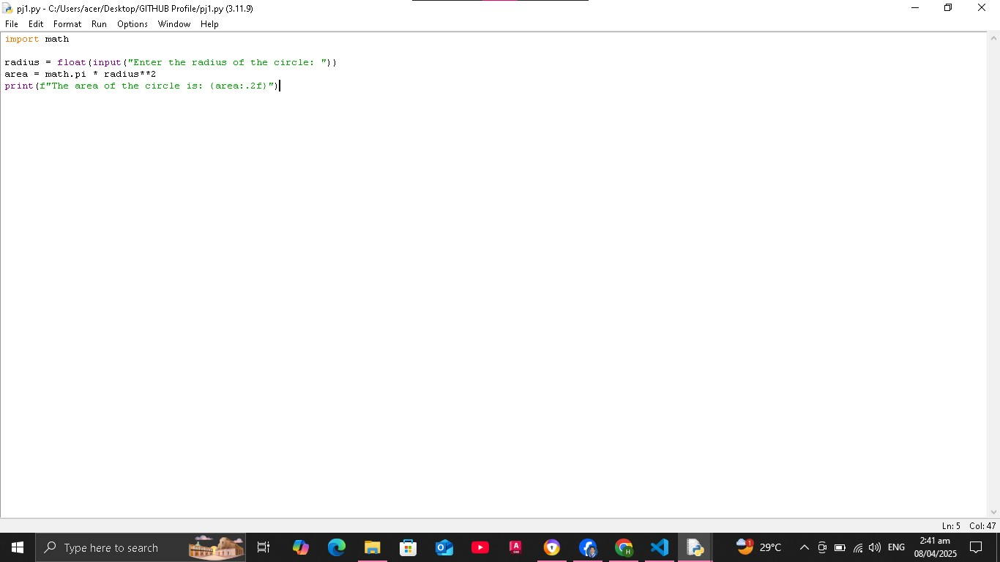
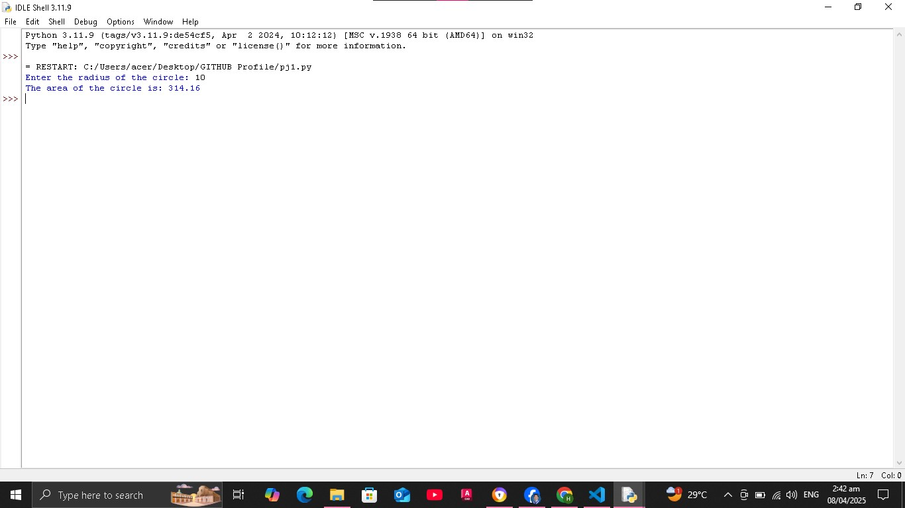
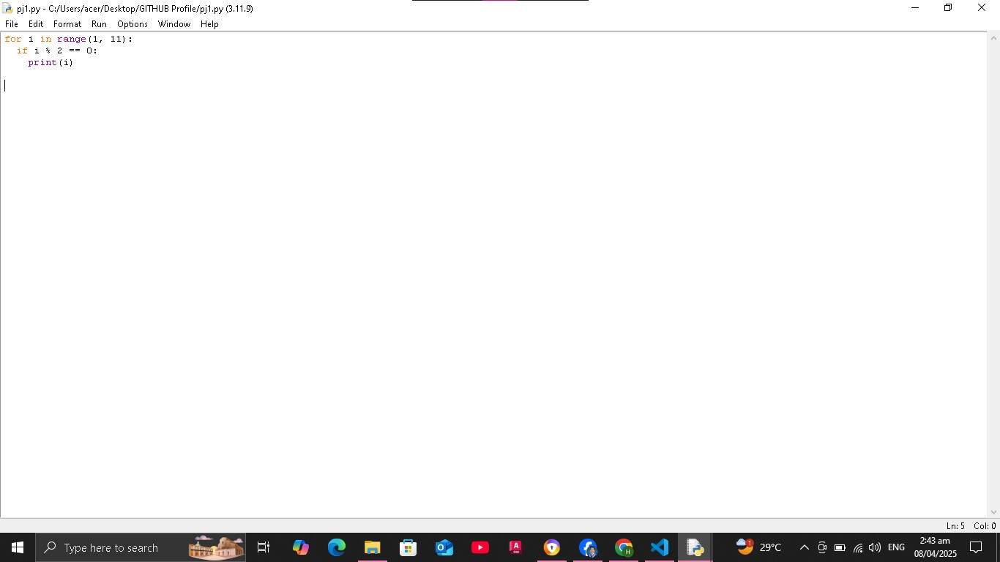
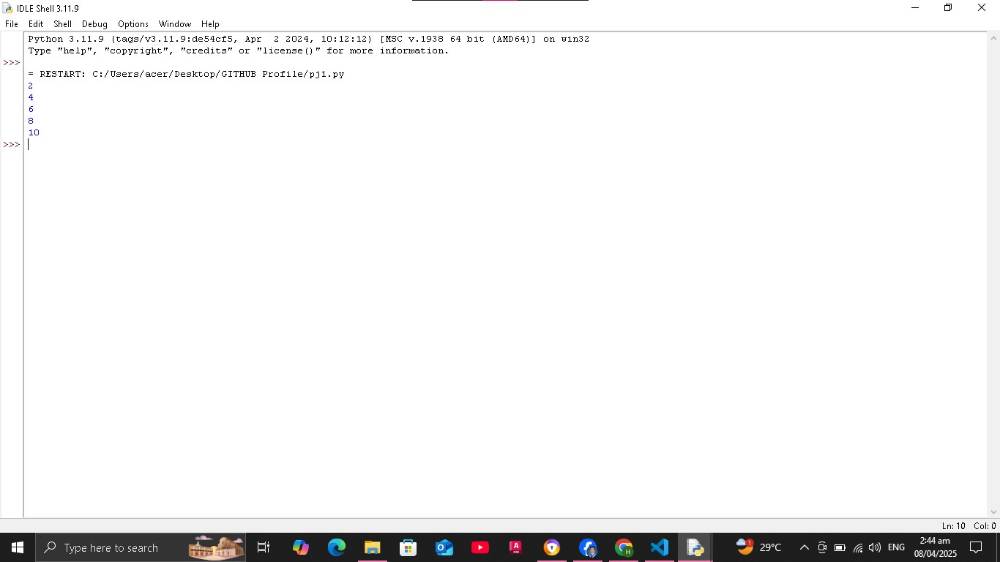
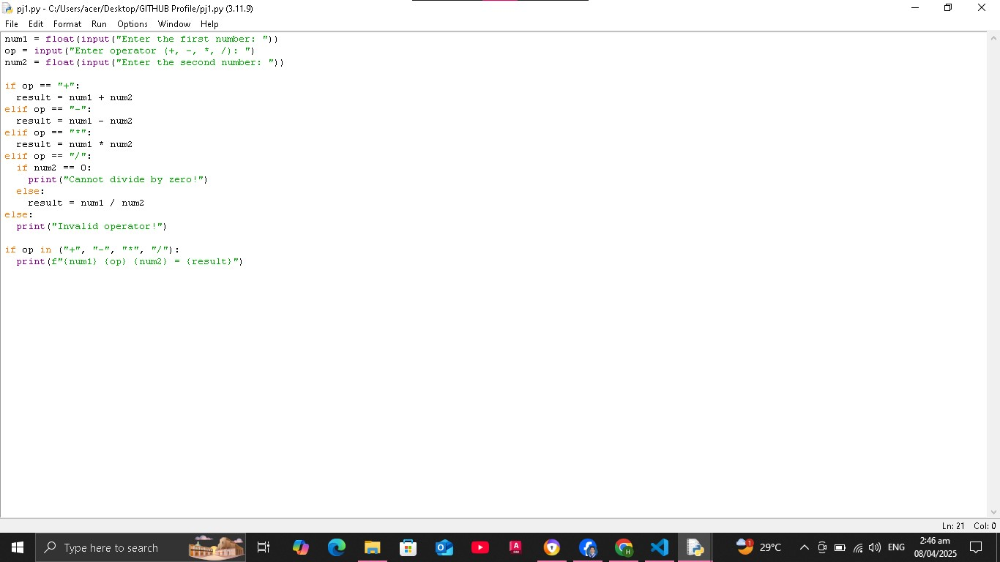
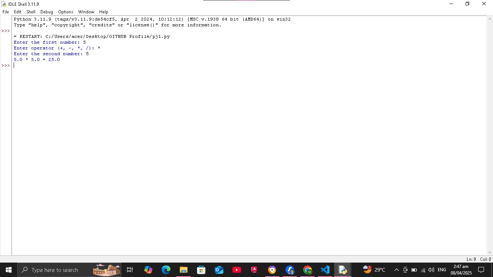

# Estember.github.io
<!DOCTYPE>
<html>
    <head>
        <title>Jacob's Profile</title>
    </head>
    
 
 

<body>

    
    
    <h1> Yes ,what may I help you?<</h1>
    <h2> Are you seeking a proficient 
 
Information Technology Professional? 
 
Look no further!!!!</h2>
 
 
<h3> Just click the link below to access my Personal Portfolio</h3>

 

<b><h1><a href="GIT-HUB Profie.html">MY PORTFOLIO</h1></a>
</b>

</html>

<!DOCTYPE>
<html>
    <head>
        <title>Jacob's Profile</title>
    </head>
     
     
     
    
    <body>

    
    
    </body> 
    <h1> Welcome to my Profile!!!</h1>
    <h2> I am Jacob A. Estember</h2>
    <h2>a Programmer and Data Analyst </h2>

<h3>

<meta name="viewport"
    <content="width=device-width, initial-scale=1">
    
    <body>

        
        
    

<body>
<b>

<b>AGE:</b> 23 years old

<b>BIRTHDAY:</b> November 09, 2001

<b>CONTACT NUMBER:</b> 09363618503

<b>GMAIL:</b> estemberjacob303@gmail.com

    <u>
 

EDUCATION BACKGROUND

</b>
</u>

 

<b>PRIMARY EDUCATION:  BAGBAG II ELEMENTARY SCHOOL

<b>JUNIOR HIGH EDUCATION:  BAGBAG NATIONAL HIGH SCHOOL( 2014-2018 )

<b>SENIOR HIGH EDUCATION:  ROSARIO INSTITUTE ( "STEM -STRAND" 2018-2020 )

<b>TERTIARY EDUCATION:  CAVITE STATE UNIVERSITY CCAT-CAMPUS (currently taking Bachelor of Science in Information Technology )

    <u>
 

    
PROGRAMMING LANGUAGES:

        </u>

        
            </head>
            <body>
            
            

              

                
              

              

                
              

              

                
              

            

            
                </head>
                <body>
                
                

                  

                    
                  

                  

                    
                  

                  

                    
                  

                

    
    

SKILLS RELATED TO INFORMATION TECHNOLOGY

    </u>

<b>Cybersecurity Analyst Description: Cybersecurity analysts are the guardians of digital fortresses. They work to protect computer systems and networks from cyberattacks, data breaches, and other online threats.  They use their knowledge of security protocols, encryption techniques, and intrusion detection systems to identify vulnerabilities and implement safeguards.

<b>Cloud Architect Description:Cloud architects are the master builders of the digital world. They design, deploy, and manage cloud computing infrastructure, applications, and services.  They leverage platforms like AWS, Azure, and Google Cloud to create scalable, reliable, and cost-effective solutions for businesses. 

<b>Data Scientist Description:Data scientists are the detectives of the digital age. They use their analytical skills and knowledge of statistics, machine learning, and programming languages to extract meaningful insights from vast datasets.  They uncover hidden patterns, predict future trends, and help businesses make data-driven decisions. 

<b>DevOps Engineer Description:DevOps engineers are the bridge between software development and IT operations. They work to automate and streamline the software development lifecycle, ensuring that applications are built, tested, and deployed efficiently and reliably.

</style>
</body>
 

    
<b><h1>
<a href="projects.html">CLICK HERE TO VISIT MY PERSONAL PROJECTS/CODES</a>
</h1></b>

    
<body>
</h3>
    </body>
    
</html>

<!DOCTYPE>
<html>
    <head>
        <title>Jacob's Profile</title>
    </head>
    
 

<body>
    
<h1>"PYTHON"</h1>

    <h2>1. Printing a Greeting:</h2>
<h3>CODE:</h3>

 

    
</head>
<body>
    

 
<h2>1. Printing a Greeting:</h2>
<h3>OUTPUT:</h3>

 

    
</head>
<body>
    

 

<body>
    <h2>2. Calculating the Area of a Circle:</h2>
<h3>CODE:</h3>

 

    
</head>
<body>
    

 
<h2>2. Calculating the Area of a Circle:</h2>
<h3>OUTPUT:</h3>

 

    
</head>
<body>
    

 
 
 
 
 
 
<body>
    <h2>3. Listing Even Numbers:</h2>
<h3>CODE:</h3>

 

    
</head>
<body>
    

 
<h2>3. Listing Even Numbers:</h2>
<h3>OUTPUT:</h3>

 

    
</head>
<body>
    

 

<body>
    <h2>4. Simple Calculator:</h2>
<h3>CODE:</h3>

 

    
</head>
<body>
    

 
<h2>4. Simple Calculator:</h2>
<h3>OUTPUT:</h3>

 

    
</head>
<body>
    

 

    
<b><h1>
<a href="Main page.html">HOME</a>
</h1></b>

    
<b><h1>
<a href="GIT-HUB Profie.html">BACK TO PROFILE</a>
</h1></b>

</body>
</html>
